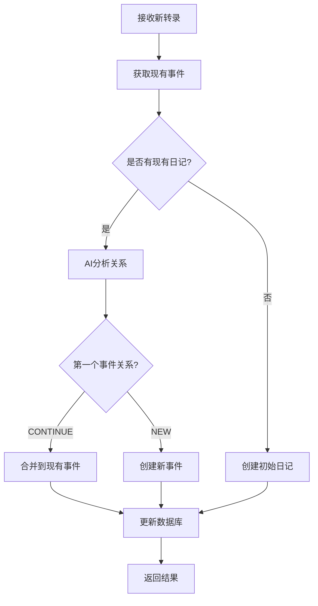

# 📈 增量分析器使用指南

## 🎯 功能概述

增量分析器为Nirva服务添加了实时处理转录内容的能力，支持：

- **🔄 增量处理**: 每3-5分钟接收新转录内容，智能判断事件边界
- **🧠 智能合并**: AI自动判断新内容是否为现有事件的延续
- **📊 实时查询**: 随时获取最新的事件状态和列表
- **💾 无缝存储**: 基于现有JournalFile结构，完全兼容

## 🚀 新增API端点

### 1. 增量分析接口

**接口**: `POST /action/analyze/incremental/v1/`

**功能**: 处理新的转录内容，自动判断是新增事件还是现有事件的延续

**请求体**:
```json
{
  "time_stamp": "2025-01-18",
  "new_transcript": "刚才Mark和Howard也到了咖啡店，我们开始讨论项目的进展..."
}
```

**响应**:
```json
{
  "updated_events_count": 1,
  "new_events_count": 0,
  "total_events_count": 2,
  "message": "成功处理增量转录，新增 0 个事件，更新 1 个事件"
}
```

### 2. 获取事件列表接口

**接口**: `POST /action/analyze/events/get/v1/`

**功能**: 获取指定日期的所有事件列表

**请求体**:
```json
{
  "time_stamp": "2025-01-18"
}
```

**响应**:
```json
{
  "time_stamp": "2025-01-18",
  "events": [
    {
      "event_id": "uuid-1234",
      "event_title": "Coffee shop work session",
      "time_range": "09:00-11:30",
      "location": "Blue Bottle Coffee",
      "activity_type": "work",
      "people_involved": ["Mark Zhang", "Howard Li"],
      "one_sentence_summary": "...",
      // ... 其他EventAnalysis字段
    }
  ],
  "total_count": 2,
  "last_updated": "2025-01-18T11:30:00Z"
}
```

## 🧠 智能分析逻辑

### 事件边界判断

AI会根据以下条件判断新转录内容是新事件还是现有事件的延续：

#### 📍 **延续现有事件** (CONTINUE)
- 相同或相近的地点
- 相似的活动类型
- 相同的参与人员
- 时间上连续（通常<30分钟间隔）

#### ✨ **创建新事件** (NEW)
- 明显的地点变化
- 活动类型改变
- 参与人员变化
- 较长的时间间隔

### 处理流程



## 💻 使用示例

### Python客户端示例

```python
import requests

BASE_URL = "http://localhost:8000"
AUTH_TOKEN = "your_auth_token"
DATE = "2025-01-18"

def send_incremental_transcript(transcript: str):
    """发送增量转录内容"""
    response = requests.post(
        f"{BASE_URL}/action/analyze/incremental/v1/",
        json={
            "time_stamp": DATE,
            "new_transcript": transcript
        },
        headers={"Authorization": f"Bearer {AUTH_TOKEN}"}
    )
    return response.json()

def get_events():
    """获取事件列表"""
    response = requests.post(
        f"{BASE_URL}/action/analyze/events/get/v1/",
        json={"time_stamp": DATE},
        headers={"Authorization": f"Bearer {AUTH_TOKEN}"}
    )
    return response.json()

# 示例使用
if __name__ == "__main__":
    # 第一次转录
    result1 = send_incremental_transcript(
        "今天早上9点到了Blue Bottle Coffee，准备开始工作。"
    )
    print(f"第一次分析: {result1['message']}")
    
    # 第二次转录（延续）
    result2 = send_incremental_transcript(
        "Mark和Howard也到了，我们开始讨论项目进展。"
    )
    print(f"第二次分析: {result2['message']}")
    
    # 第三次转录（新事件）
    result3 = send_incremental_transcript(
        "会议结束了，我离开咖啡店，现在在回家路上。"
    )
    print(f"第三次分析: {result3['message']}")
    
    # 获取所有事件
    events = get_events()
    print(f"总共 {events['total_count']} 个事件")
    for event in events['events']:
        print(f"- {event['event_title']} ({event['time_range']})")
```

### 定时处理示例

```python
import schedule
import time

def process_new_transcripts():
    """定时处理新转录内容"""
    # 这里可以从音频转录服务获取新内容
    # 或者从消息队列读取
    new_content = get_latest_transcript()  # 需要实现
    
    if new_content:
        result = send_incremental_transcript(new_content)
        print(f"处理结果: {result['message']}")

# 每3分钟处理一次
schedule.every(3).minutes.do(process_new_transcripts)

while True:
    schedule.run_pending()
    time.sleep(1)
```

## 🔧 部署和配置

### 1. 启动服务

确保所有服务正常运行：

```bash
# 激活环境
conda activate nirva

# 启动AppService (包含新的增量分析API)
make run-appservice

# 启动Analyzer服务 (用于AI分析)
make run-analyzer

# 启动Chat服务 (如果需要)
make run-chat
```

### 2. 验证功能

运行测试脚本验证功能：

```bash
python scripts/test_incremental_analyzer.py
```

### 3. API文档

访问 `http://localhost:8000/docs` 查看完整的API文档，新增的端点会显示在文档中。

## 📊 数据结构

### 现有兼容性

增量分析器完全基于现有的数据结构：

- **JournalFile**: 包含events列表和daily_reflection
- **EventAnalysis**: 详细的事件分析结果
- **JournalFileDB**: 数据库存储结构

### 数据流

```
新转录 → 增量分析器 → AI判断 → 更新JournalFile → 保存到DB
   ↓
Client查询 → 从DB读取JournalFile → 返回events列表
```

## 🧪 测试场景

### 场景1: 事件延续
```
现有: "Coffee shop work session (09:00-10:30)"
新增: "Mark和Howard到了，我们开始讨论项目"
结果: 合并到现有事件，更新参与人员和内容
```

### 场景2: 新事件
```
现有: "Coffee shop work session (09:00-10:30)"
新增: "会议结束，我离开咖啡店回家"
结果: 创建新事件 "回家途中"
```

### 场景3: 首次记录
```
现有: 无
新增: "今天早上到了咖啡店准备工作"
结果: 创建初始日记和第一个事件
```

## ⚠️ 注意事项

### 1. 性能考虑
- AI分析有2分钟超时限制
- 建议每次转录内容不超过1000字符
- 大量并发请求可能影响响应时间

### 2. 错误处理
- AI分析失败时会创建默认事件
- 网络错误会返回适当的HTTP状态码
- 数据库错误会回滚事务

### 3. 数据一致性
- 所有更新都是原子操作
- 支持并发访问
- 自动处理时间戳冲突

## 🚀 未来扩展

### 可能的增强功能
1. **批量处理**: 支持一次处理多段转录内容
2. **实时推送**: WebSocket支持实时事件更新通知
3. **智能摘要**: 自动生成事件摘要和标签
4. **情绪分析**: 增加情绪状态的实时跟踪
5. **个性化学习**: 基于用户历史数据优化判断逻辑

### 集成建议
1. **前端集成**: 在UI中添加实时事件显示
2. **移动端**: 支持语音转录的实时上传
3. **第三方服务**: 集成日历、位置等外部数据源

---

## 📞 支持

如果遇到问题或需要帮助：

1. 检查日志文件中的错误信息
2. 验证认证token是否有效
3. 确认所有依赖服务正常运行
4. 查看API文档中的详细参数说明

🎉 **现在你可以享受实时的、智能的事件处理体验了！** 